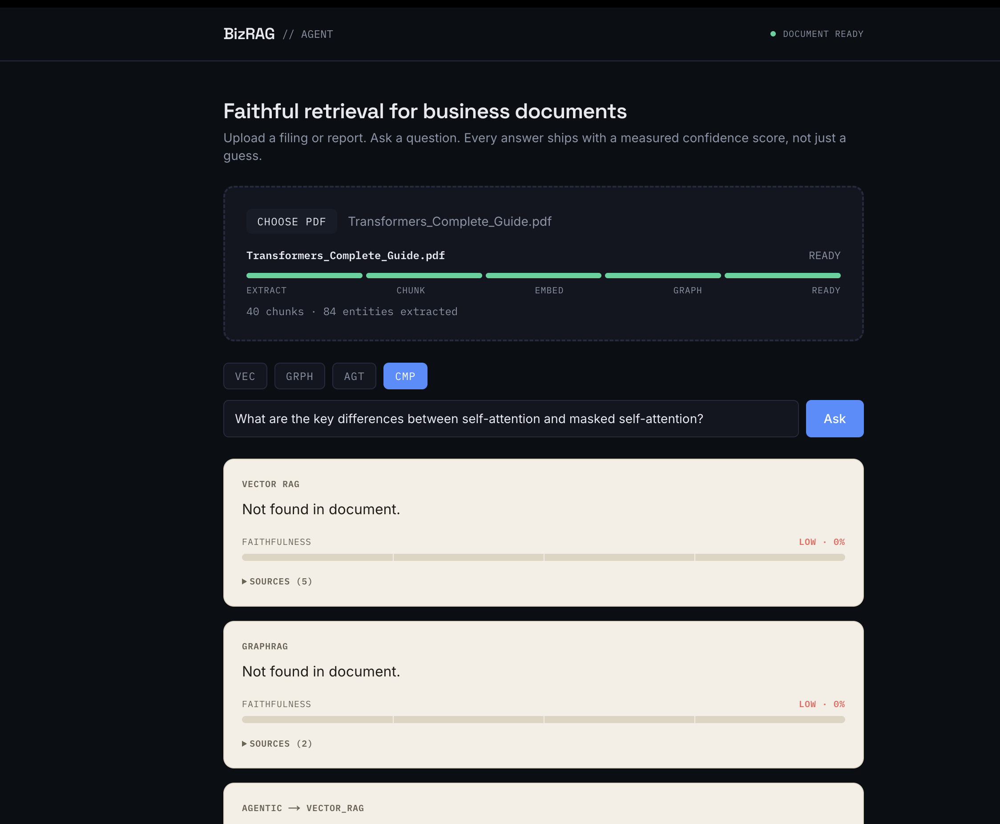
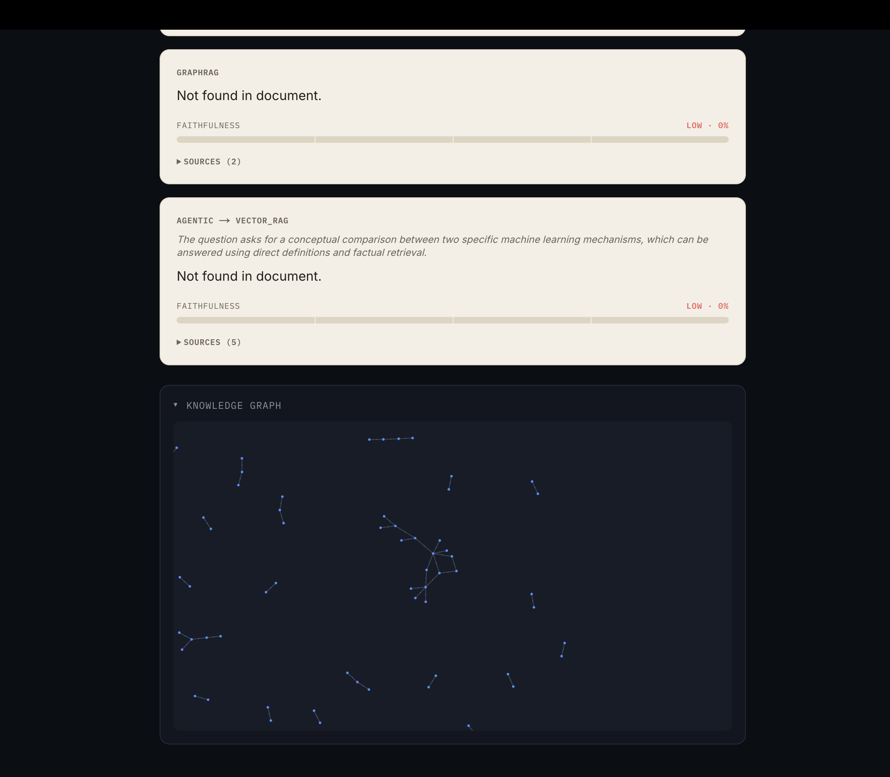

## Demo

**Compare mode** — vector RAG, GraphRAG, and the agentic orchestrator answering the same question side by side, each with an automatically measured faithfulness score. All three converge on the same "Not found in document" / LOW faithfulness verdict — the core finding of this project (see `findings.md`, Findings 4, 7, 10, 13, 15):

**Knowledge graph visualization** — entities and relationships automatically extracted from the uploaded document, rendered as an interactive force-directed graph:

See [`findings.md`](findings.md) for the full research log — 15 documented findings from building and testing this system on a real Apple 10-K SEC filing.
